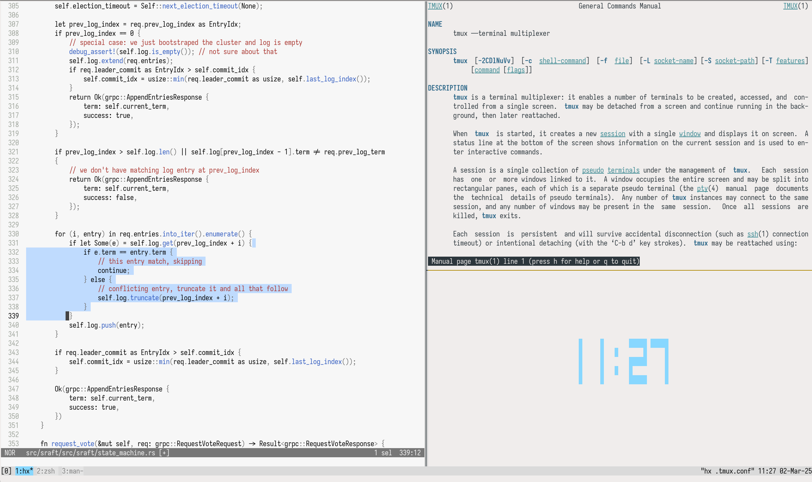

Minimalistic light theme for tmux following the same conception as [Alabaster](https://github.com/tonsky/vscode-theme-alabaster) from Tonsky -
do not use colors where they are not needed.

INSTALLATION
============
Copy contents of alabaster.conf to your ~/.tmux.conf.

